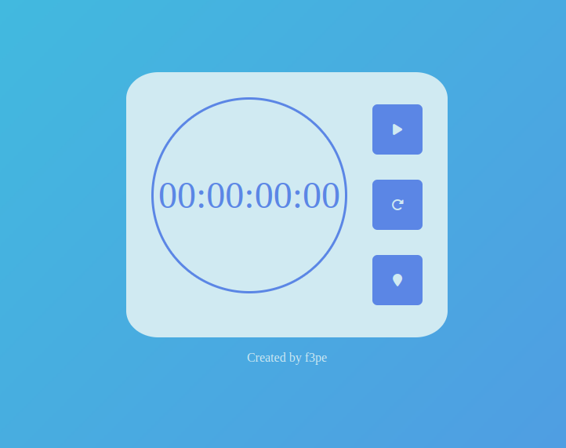

# Intuito do projeto
Este projeto é um simples cronometro feito com o intuito de praticar a base de HTML, CSS e JS.

# como usar 
Utilize o seguinte comando para clonar o projeto:
``` 
git clone https://github.com/f3pe/cronometro.git
```
Apos isso acesse o diretorio e execute o arquivo `index.html` com o navegador.

# imagen do projeto
